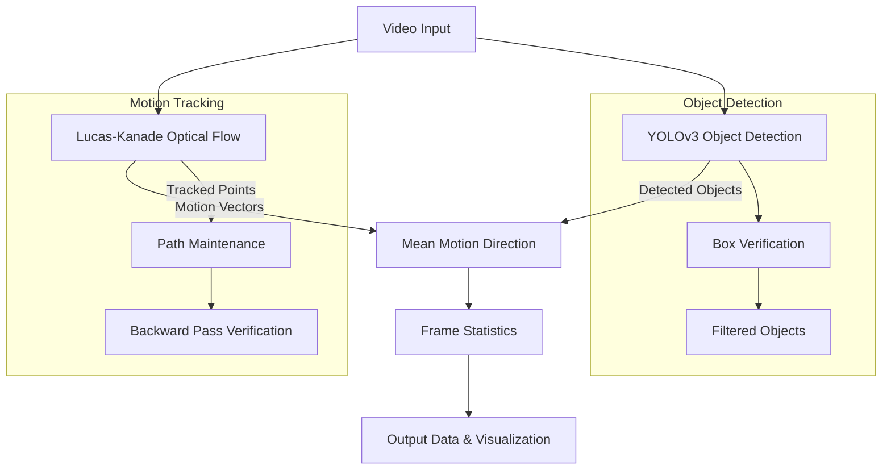
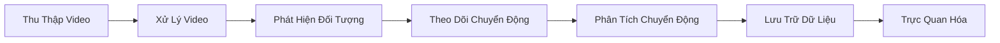
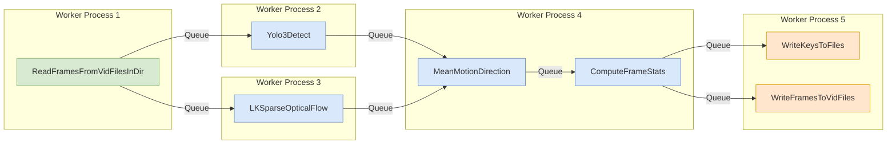

# Jakarta Analyze

Bộ công cụ ## Thuật Toán

### Sơ đồ kỹ thuật

### Phát Hiện Đối Tượng

Jakarta Analyze sử dụng YOLOv3 (You Only Look Once) để phát hiện đối tượng thời gian thực:diện để phân tích mô hình giao thông ở Jakarta sử dụng kỹ thuật xử lý video, thị giác máy tính và học máy.

## Cách Hoạt Động

Jakarta Analyze là một hệ thống dựa trên pipeline mô-đun để xử lý video giao thông từ camera CCTV của Jakarta. Hệ thống hoạt động như sau:

1. **Thu Thập Video**: Tải xuống video từ camera CCTV giao thông Jakarta hoặc sử dụng tệp video được lưu trữ cục bộ
2. **Xử Lý Video**: Xử lý video thông qua hệ thống pipeline có thể cấu hình
3. **Phát Hiện Đối Tượng**: Sử dụng phát hiện đối tượng YOLO để nhận diện phương tiện, người đi bộ và các đối tượng khác
4. **Theo Dõi Chuyển Động**: Áp dụng luồng quang học thưa Lucas-Kanade để theo dõi đối tượng giữa các khung hình
5. **Phân Tích Chuyển Động**: Tính toán hướng chuyển động trung bình và các số liệu luồng giao thông khác
6. **Lưu Trữ Dữ Liệu**: Lưu kết quả vào tệp hoặc cơ sở dữ liệu để phân tích thêm
7. **Trực Quan Hóa**: Cung cấp công cụ để trực quan hóa metadata đã trích xuất

### Sơ đồ luồng xử lý

Hệ thống được xây dựng dựa trên kiến trúc pipeline linh hoạt, trong đó mỗi bước xử lý được triển khai như một worker trong pipeline. Các worker giao tiếp thông qua hàng đợi, cho phép xử lý song song hiệu quả.

### Cấu trúc pipeline

## Algorithms

### Object Detection

Jakarta Analyze uses YOLOv (You Only Look Once) for real-time object detection:

- **YOLO Model**: Uses Ultralytics YOLO implementation for efficient object detection
- **Object Verification**: Applies additional verification to detected objects:
  - Minimum area threshold to filter out small detections
  - Aspect ratio validation to ensure detections have reasonable proportions
  - Class-specific validation (e.g., higher confidence for unusual vehicle proportions)

### Motion Tracking

The system implements Lucas-Kanade sparse optical flow for motion tracking:

1. **Feature Detection**: Automatically detects good features to track in video frames
2. **Point Tracking**: Tracks points across consecutive frames using pyramidal Lucas-Kanade method
3. **Duy Trì Đường Dẫn**: Duy trì đường dẫn cho các điểm được theo dõi để phân tích mô hình chuyển động
4. **Xác Minh Đường Đi Ngược**: Tùy chọn thực hiện xác minh ngược để đảm bảo chất lượng theo dõi

### Phân Tích Luồng Giao Thông

Luồng giao thông được phân tích thông qua một số kỹ thuật:

1. **Hướng Chuyển Động Trung Bình**: Tính toán hướng chuyển động chủ đạo cho các đối tượng
2. **Biên Độ Chuyển Động**: Đo tốc độ chuyển động của các đối tượng được phát hiện
3. **Phát Hiện Đối Tượng Tĩnh**: Xác định các đối tượng có chuyển động tối thiểu
4. **Thống Kê Khung Hình**: Tính toán các chỉ số thống kê khác nhau từ khung hình đến khung hình

## Mục Tiêu

Dự án Jakarta Analyze hướng tới:

1. **Theo Dõi Giao Thông**: Cung cấp phân tích thời gian thực về điều kiện giao thông từ cảnh quay CCTV
2. **Phát Hiện Tắc Nghẽn**: Tự động xác định khu vực tắc nghẽn giao thông
3. **Phân Tích Luồng**: Tính toán và trực quan hóa các mô hình luồng giao thông
4. **Đếm Phương Tiện**: Đếm phương tiện theo loại (ô tô, xe buýt, xe máy, v.v.)
5. **Phát Hiện Bất Thường**: Xác định các mô hình giao thông bất thường hoặc sự cố
6. **Thu Thập Dữ Liệu**: Xây dựng bộ dữ liệu toàn diện về mô hình giao thông Jakarta
7. **Nền Tảng Nghiên Cứu**: Làm nền tảng cho nghiên cứu thêm về thị giác máy tính và phân tích giao thông
